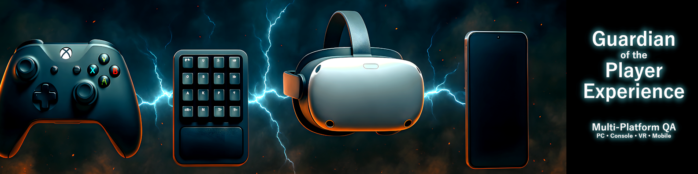

<link rel="stylesheet" href="{{ site.baseurl }}/assets/css/style.css?v=3">

  <!-- your markdown/HTML content goes here (sections, tables, etc.) -->

  

### Welcome to my QA portfolio.

Here you’ll find eight full case studies that show a professional range of testing skills across PC, mobile, and VR — from functional and exploratory work to cross-platform, input, narrative/localisation, and early automation.

### 🧠 Self-Directed QA Learning Programme

This portfolio follows an eight-project roadmap I designed to mirror real studio workflows. Each project includes a clear goal, a complete practical QA workbook, Jira workflow, evidence clips and screenshots, and a concise STAR summary — focusing on reproducible bugs, readable documentation, and player-centred quality.

---

## 🧩 Project Lineup

<section markdown="1" class="project-block with-thumb">
  

### 1️: Functional Testing – *Battletoads (PC Game Pass)*

<strong style="color:inherit">Goal:</strong> Validate core gameplay and document repeatable defects, with extra attention to keyboard ↔ controller hand-off.  
<strong style="color:inherit">Focus:</strong> Gameplay logic · UI/menus · Input parity · Audio cues · Performance sanity  
<strong style="color:inherit">Tools:</strong> Jira · Google Sheets QA workbook · Xbox Game Bar / OBS  
<strong style="color:inherit">Deliverables:</strong> QA workbook (Sheets + PDF) · Evidence videos (YouTube) · Jira board + verified thumbnails  
<strong style="color:inherit">Result:</strong> Stable overall; surfaced 4 high-impact input/hand-off issues around Pause/Join-In/Resume with 16/16 reproducible runs.

🕹️ **Why this game?** A fast, recognisable brawler that’s perfect for testing input ownership and local co-op edge cases.  

  <a class="cta-btn" href="https://kelinacowellqa.github.io/Manual-QA-Portfolio-Kelina-Cowell/projects/battletoads/">Read the case study →</a>

</section>

<section markdown="1" class="project-block with-thumb">
  

### 2️: Exploratory & Edge-Case Testing – *Rebel Racing (Mobile)*

<strong style="color:inherit">Goal:</strong> Probe the core loop and push edge cases to see where UX and stability crack — not just “happy path” play.  
<strong style="color:inherit">Focus:</strong> Device compatibility · Screen scaling · Touch responsiveness · Interruptions (calls/notifications) · Offline/poor network · Orientation switches · Low battery/storage</strong>  
<strong style="color:inherit">Tools:</strong> Google Sheets session charters & notes · On-device screen recordings (iOS/Android) · Network throttling (Airplane/Low-bandwidth) · Device matrix  
<strong style="color:inherit">Deliverables:</strong> Session charters · Edge-case checklist · Issue list with risk tags · Short evidence clips  
<strong style="color:inherit">Result:</strong> In progress — early passes are mapping risks across device classes and network conditions. 

🕹️ **Why this game?** Tight, repeatable loop with live-ops UI — ideal for surfacing scaling, input, and interruption edge cases on mobile.

**Coming soon:** full case study page with evidence, risk map, and metrics.

</section>

<section markdown="1" class="project-block with-thumb">
  

### 3: Regression Testing – *Sworn (PC)*

<strong style="color:inherit">Goal:</strong> Re-test recent fixes to confirm they hold up and catch any side-effects before release.  
<strong style="color:inherit">Focus:</strong> Save/load integrity · Input/control mapping · UI scaling & readability · Patch-notes verification  
<strong style="color:inherit">Tools:</strong> Jira regression suite · Before/after evidence clips · Build notes  
<strong style="color:inherit">Deliverables:</strong> Regression log · Verification matrix · Before/after screenshots & short videos  
<strong style="color:inherit">Result:</strong> In progress — working through the first patch set and tracking any reopens or knock-on issues.  

🕹️ **Why this game?** Frequent updates and systems-heavy gameplay make it perfect for disciplined regression passes.  

**Coming soon:** full case study page with verification matrix, before/after clips, and regression metrics.

</section>

<section markdown="1" class="project-block with-thumb">
  

### 4: Cross-Platform QA – *Shadow Point (VR & PCVR)*

<strong style="color:inherit">Goal:</strong> Show VR-specific QA awareness — comfort, tracking stability, and parity between standalone and PCVR.  
<strong style="color:inherit">Focus:</strong> Frame stability · Tracking accuracy · Motion/rotation comfort · Guardian/boundary behaviour · Visual/text parity · Interaction parity · Performance spikes  
<strong style="color:inherit">Tools:</strong> Google Sheets session charters & test matrix · OBS/Quest capture · SteamVR/OVR frame-timing overlays · Side-by-side comparison notes  
<strong style="color:inherit">Deliverables:</strong> Comfort checklist (ratings) · Tracking test results · Parity comparison clips/screens · Issue list with risk tags  
<strong style="color:inherit">Result:</strong> In progress — building like-for-like runs on headset and PCVR, logging any comfort dips, judder, or interaction/visual parity gaps.  

🕹️ **Why this game?** A calm, deliberate puzzle adventure that’s perfect for spotting micro-judder, text legibility issues, and subtle interaction differences across platforms.

**Coming soon:** full case study page with comfort metrics, frame-timing snapshots, and a parity gallery.

</section>

<section markdown="1" class="project-block with-thumb">
  

### 5: Cross-Platform Input QA – *Recompile (PC / Controller)*

<strong style="color:inherit">Goal:</strong> Validate controller responsiveness and ensure input mappings behave consistently across devices and contexts.  
<strong style="color:inherit">Focus:</strong> Mapping parity (Xbox/PlayStation layouts) · Latency & responsiveness · Haptics/rumble cues · UI prompts vs. active device · Keyboard/controller hand-off · Rebinds & edge cases  
<strong style="color:inherit">Tools:</strong> Google Sheets test matrix · Input latency notes (video timestamps) · OBS/Game Bar captures · Controller layout references  
<strong style="color:inherit">Deliverables:</strong> Input mapping matrix · Latency observations with clips · Mismatch log (prompts vs. device) · Rebind test results  
<strong style="color:inherit">Result:</strong> In progress — building parity checks and timing captures across menus, gameplay, and pause/overlay states.  

🕹️ **Why this game?** Fast, precise movement and frequent mode switches make input mismatches and latency spikes easy to spot.

**Coming soon:** full case study page with mapping matrix, timing clips, and parity findings.

</section>

<section markdown="1" class="project-block with-thumb">
  
  
### 6: Narrative / Localisation QA – *Oxenfree (Netflix Mobile)*

<strong style="color:inherit">Goal:</strong> Check that dialogue, subtitles, and UI text read naturally and stay in sync on mobile — no typos, timing slips, or speaker mix-ups.  
<strong style="color:inherit">Focus:</strong> Subtitle timing & sync · Line breaks/overflow · Speaker tags · Tone/idiom checks · Punctuation & typography · UI text legibility · Locale/device language behaviour  
<strong style="color:inherit">Tools:</strong> Google Sheets script log & timing notes · On-device screen recordings (Android) · Style/terminology checklist · Font/size legibility checks  
<strong style="color:inherit">Deliverables:</strong> Subtitle timing log · Text/typo issue list with screenshots · Style/terminology notes · Short evidence clips  
<strong style="color:inherit">Result:</strong> In progress — mapping dialogue-heavy scenes, checking subtitle pacing against VO/SFX, and flagging any truncation or misattribution.  

🕹️ **Why this game?** Choice-heavy dialogue and moody SFX make timing, tone, and readability crucial — perfect for narrative/localisation checks on mobile.

**Coming soon:** full case study page with timing examples, before/after text fixes, and readability findings across devices.

</section>

<section markdown="1" class="project-block with-thumb">
  

### 7: Automation Testing – *PowerWash Simulator (PC)*

<strong style="color:inherit">Goal:</strong> Demonstrate early automation skills by scripting repeatable checks and quick regressions on core flows.  
<strong style="color:inherit">Focus:</strong> Launch → menu → job select smoke · Settings persistence · Save/load state · Input macro checks (KB/mouse/controller) · Simple visual comparisons for “clean/dirty” states  
<strong style="color:inherit">Tools:</strong> Lightweight scripts (AutoHotkey/Python) · Timed input macros · OBS for capture · (Trial) image-compare snapshots for before/after  
<strong style="color:inherit">Deliverables:</strong> Smoke macro scripts · Regression checklist · Short evidence clips · Comparison snapshots  
<strong style="color:inherit">Result:</strong> In progress — first smoke passes cover launch-to-job select and settings persistence; exploring image comparisons to sanity-check “clean” completion states.  

🕹️ **Why this game?** Clear, repeatable loops make it ideal for simple automation and quick regression validation without full engine hooks.

**Coming soon:** full case study page with scripts, run logs, and before/after comparisons.

</section>

---

## ✅ Coverage Map

| Project              | QA Type                      | Platform            | Focus                                     | Status        |
|----------------------|------------------------------|---------------------|-------------------------------------------|---------------|
| Battletoads          | Functional                   | PC (Game Pass)      | Core flows · Input ownership · UI/menus   | Live          |
| Rebel Racing         | Exploratory & Edge-Case      | Mobile              | Scaling · Touch · Interruptions · Network | Coming soon   |
| Sworn                | Regression                   | PC                  | Save/load · Input mapping · UI scaling    | Coming soon   |
| Shadow Point         | Cross-Platform (VR & PCVR)   | VR / PCVR           | Comfort · Tracking · Parity               | Coming soon   |
| Recompile            | Cross-Platform Input         | PC / Controller     | Mapping parity · Latency · Prompts        | Coming soon   |
| Oxenfree             | Narrative / Localisation     | Netflix Mobile      | Subtitles · Timing · Readability          | Coming soon   |
| Project 7            | (TBD)                        | (TBD)               | (TBD)                                     | Coming soon   |
| PowerWash Simulator  | Automation                   | PC                  | Smoke scripts · Regression checks         | Coming soon   |

---

## 🧰 Tools Used
- **Planning & tracking:** Jira · GitHub
- **Docs & data:** Google Sheets (QA workbook)
- **Capture & evidence:** OBS / Xbox Game Bar · YouTube · Android screen recording
- **VR diagnostics:** SteamVR Frame Timing (PCVR) · OVR Metrics Tool (Quest 3)
- **Automation:** AutoHotkey · Python (light scripts)

---

## 🧠 Skills
- **Core QA:** Functional · Exploratory & edge-case · Regression
- **Platforms:** PC · Mobile · VR/PCVR · Controller/keyboard parity
- **Specialisms:** Input QA · Narrative/localisation · Player experience
- **Test design:** Test cases · Session charters · Risk/priority tagging
- **Execution:** Clear repro steps · Evidence capture (video) · Jira workflows
- **Automation (early):** Simple scripts/macros for smoke & regression

---

## 🌟 Summary
I test games the way players experience them: clearly, patiently, and with evidence. This portfolio shows practical QA across PC, mobile, and VR—backed by tidy documentation, reproducible bugs, and short clips that make issues easy to understand. My aim is simple: help teams ship smoother, clearer, more enjoyable games.

---

## 🍀 Connect

**Kelina Cowell – Multiplatform Games Tester**  
🔗 [LinkedIn](https://www.linkedin.com/in/kelina-cowell-qa-tester)  
📧 kelinacowell.qa@gmail.com  

---

## 📎 Disclaimer
*This is a personal, non-commercial portfolio for educational and recruitment purposes. I’m not affiliated with or endorsed by any game studios or publishers. All trademarks, logos, and game assets are the property of their respective owners. Any screenshots or short clips are included solely to document testing outcomes. If anything here needs to be removed or credited differently, please contact me and I’ll update it promptly.*

