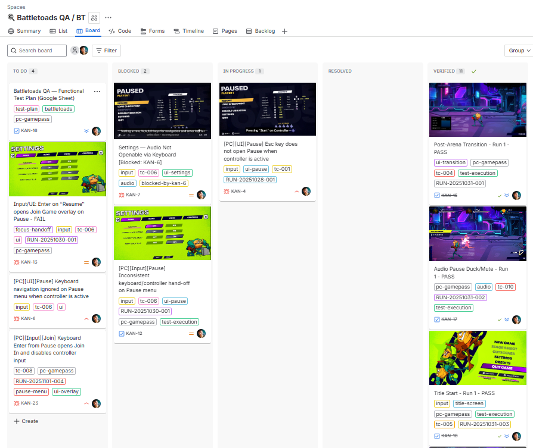
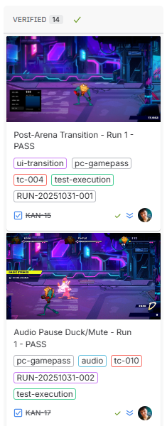
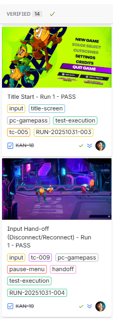
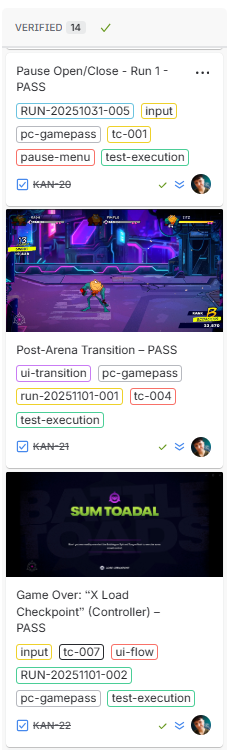
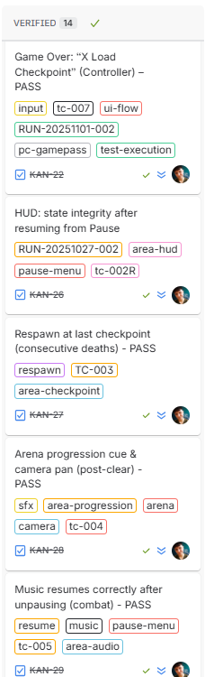

# 🎮 Battletoads — Functional Testing (PC Game Pass)

[⬅ Back to Portfolio Home](https://kelinacowellqa.github.io/QA-Portfolio-Kelina-Cowell/)

**Studio:** Dlala Studios / Rare
**Platform:** PC (Game Pass)
**Scope:** Gameplay logic • UI • Audio • Performance

---

## 🎯 Goal

Validate core gameplay flows and document reproducible defects with clear severity and repro steps.

---

## 🧩 Focus Areas

* Gameplay logic
* UI / navigation
* Input & controller
* Audio
* Performance

---

## 🧾 Deliverables

* Test plan (Google Sheets)
* Bug report (PDF)
* Evidence screenshots
* Evidence video (YouTube)
* Jira workflow / board screenshot
* STAR summary

---

## 📊 Metrics

| Metric            | Value |
| :---------------- | :---- |
| Total Bugs Logged |       |
| Critical          |       |
| Major             |       |
| Minor             |       |
| Repro Consistency |       |

> Replace values with your actual counts from the board/report.

---

## 🧠 STAR SUMMARY – Battletoads QA (PC Game Pass)

**Situation:** One-week functional test of Battletoads on Win11, Game Pass build 1.1F.42718, 1920×1080@144Hz, Xbox-layout controllers + keyboard.

**Task:**  Validate core gameplay logic, UI flow, input handling (keyboard/controller focus), audio cues, and basic performance.

**Action:**  Built a test plan, executed the suite daily, captured repro video with Xbox Game Bar/OBS, and logged defects in Jira with clear titles, steps, and evidence.

**Result:**  Surface-level stability is good, but testing revealed several high-impact defects blocking keyboard-only play and local co-op start; findings are prioritised and linked with clips for rapid triage.

---

## ⚙ Jira & Agile Practice

Brief note connecting this project to your current Jira course learnings (board setup, transitions, evidence attachments, etc.).

---

## 📷 Evidence & Media

| Type                               | File / Link |
|:-----------------------------------|:------------|
| **QA Workbook (Google Sheets)**    | [Open Workbook](https://docs.google.com/spreadsheets/d/17_BCpZrtCTItn-ieGcG1PExIGnlLe1Bg/edit?usp=sharing) |
| **QA Workbook (PDF Export)**       | [Battletoads_QA_Functional_TestPlan_PCGamePass_Kelina_Cowell_PORTFOLIO.pdf](./bug_reports/Battletoads_QA_Functional_TestPlan_PCGamePass_Kelina_Cowell_PORTFOLIO.pdf) |
| Jira Board Screenshots              | ### Jira Board — Overview

### Jira Board — Verified (thumbnails)

<table>
  <tr>
    <td>
      
    </td>
    <td>
      
    </td>
    <td>
      
    </td>
    <td>
      
    </td>
  </tr>
</table>

Click any thumbnail to view the full-size image.

### Bugs — summary + videos

| ID | Title | Sev | Repro | Video |
|:--:|:------|:---:|:-----:|:------|
| 01 | Pause: keyboard (Esc/P) doesn’t open Pause; controller Start works | High | 5/5 |  |
| 02 | Pause menu: controller→keyboard hand-off fails (keyboard ignored) | High | 5/5 |  |
| 03 | Resume misroute: **Enter** on *Resume* opens *Join In* overlay | High | 3/3 |  |
| 04 | Keyboard-only path blocked for local co-op start | High | 3/3 |  |

  
<strong>Show inline videos</strong> (opens four embeds)

  

    <iframe src="https://www.youtube.com/embed/YOUTUBE_ID_01?modestbranding=1&rel=0" title="Bug 01" style="position:absolute;top:0;left:0;width:100%;height:100%;border:0;" allow="accelerometer; autoplay; clipboard-write; encrypted-media; gyroscope; picture-in-picture; web-share" allowfullscreen></iframe>
  

  

    <iframe src="https://www.youtube.com/embed/YOUTUBE_ID_02?modestbranding=1&rel=0" title="Bug 02" style="position:absolute;top:0;left:0;width:100%;height:100%;border:0;" allow="accelerometer; autoplay; clipboard-write; encrypted-media; gyroscope; picture-in-picture; web-share" allowfullscreen></iframe>
  

  

    <iframe src="https://www.youtube.com/embed/YOUTUBE_ID_03?modestbranding=1&rel=0" title="Bug 3" style="position:absolute;top:0;left:0;width:100%;height:100%;border:0;" allow="accelerometer; autoplay; clipboard-write; encrypted-media; gyroscope; picture-in-picture; web-share" allowfullscreen></iframe>
  

  

    <iframe src="https://www.youtube.com/embed/YOUTUBE_ID_04?modestbranding=1&rel=0" title="Bug 4" style="position:absolute;top:0;left:0;width:100%;height:100%;border:0;" allow="accelerometer; autoplay; clipboard-write; encrypted-media; gyroscope; picture-in-picture; web-share" allowfullscreen></iframe>
  

 |
| Workflow Screenshot                | [workflow.png](./jira_workflow/workflow.png) |
| Video Clip (YouTube)               | [Watch evidence clip](https://www.youtube.com/...) |
| Key Bug Screenshot 1               | [bug_01.png](./media/bug_01.png) |
| Key Bug Screenshot 2               | [bug_02.png](./media/bug_02.png) |

---

## 🧩 Lessons Learned

One to two concise insights on documentation clarity, reproducibility, or workflow.

---

## 🔗 Related Files

* [`bug_reports/`](./bug_reports/)
* [`jira_workflow/`](./jira_workflow/)
* [`media/`](./media/)
