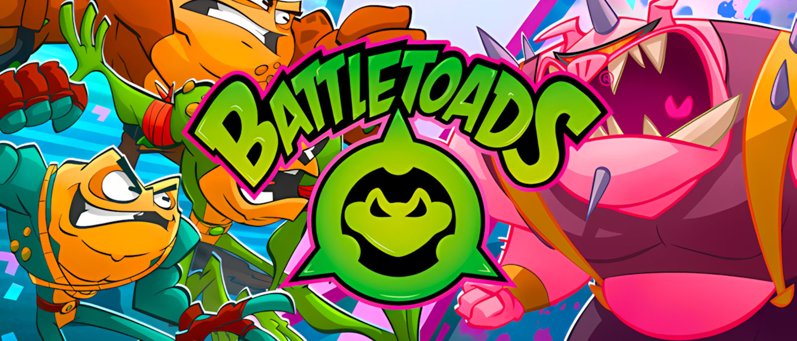

  

# 🎮 Battletoads — Functional Testing (PC Game Pass)

[⬅ Back to Portfolio Home](https://kelinacowellqa.github.io/QA-Portfolio-Kelina-Cowell/)

| Studio | Platform | Scope |
|:--|:--|:--|
| Dlala Studios / Rare | PC (Game Pass) | Gameplay logic • UI • Audio • Performance |

---

## 🎯 Goal
Demonstrate core QA fundamentals by validating key gameplay flows and documenting reproducible defects with clear severity and repro steps.

---

## 🧩 Focus Areas

* Gameplay logic
* UI / navigation
* Input & controller
* Audio
* Performance

---

## 🧾 Deliverables

* Test plan (Google Sheets)
* Bug report (PDF)
* Evidence videos (YouTube)
* Jira workflow / board screenshots
* STAR summary

---

## 📊 Metrics

| Metric            | Value |
| :---------------- | :---- |
| Total Bugs Logged |   4    |
| Critical          |   0    |
| Major             |    4  |
| Minor             |   0    |
| Repro Consistency |    **100%** (16/16 across 4 issues)   |

---

## 🧠 STAR SUMMARY – Battletoads QA (PC Game Pass)

**Situation:** One-week functional test of Battletoads on Win11, Game Pass build 1.1F.42718, 1920×1080@144Hz, Xbox-layout controllers + keyboard.

**Task:**  Validate core gameplay logic, UI flow, input handling (keyboard/controller focus), audio cues, and basic performance.

**Action:**  Built a test plan, executed the suite daily, captured repro video with Xbox Game Bar/OBS, and logged defects in Jira with clear titles, steps, and evidence.

**Result:**  All four issues were fully reproducible (**16/16 attempts**), with clear evidence clips for each.

---

## ⚙ Jira & Agile Practice

I applied fundamentals from two beginner Jira courses to keep this project structured and evidence-driven.

- **Intro to JIRA (Simplilearn):** Set up a clean board and project from scratch, defined issue types, and used attachments/comments for evidence (short clips + screenshots). This kept every defect self-contained and easy to triage.
- **Get Started with Jira (Coursera):** Built a Kanban workflow with clear transitions (To Do → In Progress → Blocked → Verified), added simple WIP limits, and used labels (e.g., `pc-gamepass`, `test-execution`) so the board stayed filterable during runs.

**Practice in this project**
- Created issues directly from test runs, attaching repro clips and exact steps.
- Used **Blocked** to surface input-ownership problems quickly, then moved to **Verified** with video proof after re-test.
- Maintained short, consistent titles so tickets were scannable on the board and in the README.
  
**Certificates (PDF)**
- [Intro to JIRA — certificate](../../jira_training/screenshots/intro-to-jira_simplilearn_cert.pdf)
- [Get Started with Jira — certificate](../../jira_training/screenshots/get-started-with-jira_coursera_cert.pdf)

---

## 📷 Evidence & Media

| Type                               | File / Link |
|:-----------------------------------|:------------|
| **QA Workbook (Google Sheets)**    | [Open Workbook](https://docs.google.com/spreadsheets/d/17_BCpZrtCTItn-ieGcG1PExIGnlLe1Bg/edit?usp=sharing) |
| **QA Workbook (PDF Export)**       | [Battletoads_QA_Functional_TestPlan_PCGamePass_Kelina_Cowell_PORTFOLIO.pdf](./bug_reports/Battletoads_QA_Functional_TestPlan_PCGamePass_Kelina_Cowell_PORTFOLIO.pdf) |

### Jira Board Screenshot - Overview

### Jira Board — Verified Screenshots (thumbnails)

<table>
  <tr>
    <td>
      
    </td>
    <td>
      
    </td>
    <td>
      
    </td>
    <td>
      
    </td>
  </tr>
</table>

Click any thumbnail to view the full-size image.

### Bugs — summary + videos

| ID | Title | Sev | Repro | Video |
|:--:|:------|:---:|:-----:|:------|
| 01 | Pause: keyboard (Esc/P) does not open Pause – controller Start works | High | 5/5 |  |
| 02 | Keyboard input ignored on Pause menu after using controller | High | 5/5 |  |
| 03 | Pause menu keyboard/controller hand-off | High | 3/3 |  |
| 04 | Pause/Join In: Enter opens Join In & disables controller input (only Enter/Esc work) | High | 3/3 |  |

Repro totals = sum of all successful attempts ÷ sum of attempts (e.g., 5/5 + 5/5 + 3/3 + 3/3 = 16/16 = 100%).

  
Show inline videos

  
<em>If you’re viewing this on github.com, embeds may not display. 
  Use the thumbnails/links above or open this page on the published site (GitHub Pages) to watch inline.</em>

  

    <iframe src="https://www.youtube.com/embed/2CAUt8gxH3M?modestbranding=1&rel=0"
            title="Bug 01 — Pause: keyboard does not open Pause"
            allow="accelerometer; autoplay; clipboard-write; encrypted-media; gyroscope; picture-in-picture; web-share"
            allowfullscreen></iframe>
  

  

    <iframe src="https://www.youtube.com/embed/5DZjJc4y_yA?modestbranding=1&rel=0"
            title="Bug 02 — Keyboard input ignored on Pause menu after controller use"
            allow="accelerometer; autoplay; clipboard-write; encrypted-media; gyroscope; picture-in-picture; web-share"
            allowfullscreen></iframe>
  

  

    <iframe src="https://www.youtube.com/embed/EJFduFM28Is?modestbranding=1&rel=0"
            title="Bug 03 — Pause menu keyboard/controller hand-off"
            allow="accelerometer; autoplay; clipboard-write; encrypted-media; gyroscope; picture-in-picture; web-share"
            allowfullscreen></iframe>
  

  

    <iframe src="https://www.youtube.com/embed/CXFI2a6DEpM?modestbranding=1&rel=0"
            title="Bug 04 — Pause/Join In: Enter opens Join In & disables controller input"
            allow="accelerometer; autoplay; clipboard-write; encrypted-media; gyroscope; picture-in-picture; web-share"
            allowfullscreen></iframe>
  

---

## 🧩 Lessons Learned

- Clear steps beat clever wording — they made my re-tests painless.
- Input hand-off needed its own checks; that’s where the real bugs were.
- Short videos did the heavy lifting when explaining severity.
  
  ## 📎 Disclaimer
This is a personal, non-commercial portfolio project for learning and job-search purposes. I’m not affiliated with or endorsed by Dlala Studios, Rare, or Microsoft. All trademarks, logos, and game assets are the property of their respective owners. Any screenshots or short clips are included solely to document testing outcomes. If something here needs to be removed or credited differently, please contact me and I’ll fix it promptly.

---

